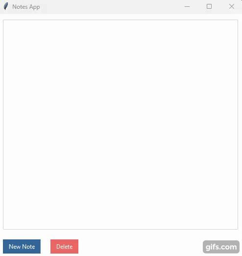

# Simple Whiteboard

Simple Notepad app

App was made following [this](https://www.youtube.com/watch?v=NZbxcxRRFjU&ab_channel=AlinaChudnova) tutorial made by youtuber Alina Chudnova.

### Features

- Create notes
- Delete them
- Edit them
- Store them

## Demo

## Requirements
- Python 3+
- ttkbootstrap

## Usage

1. Run 'python notepad.py'